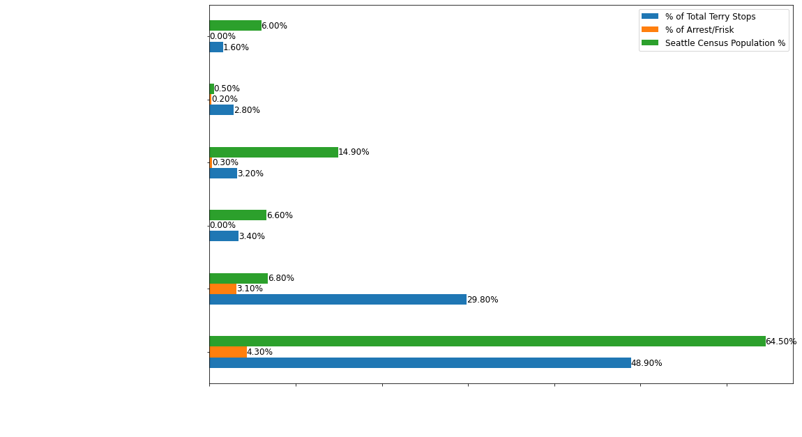

# Terry Stops

## Business Understanding
Ethnic Fathers' of Seattle and the Seattle police chief are concerned with the impact terry stops have had on the community.

#### Stakeholder:
- Ethnic Father's of Seattle
- Seattle Police Chief/Staff
- Non-Technical stakeholder

#### Context:
- **False Negative**: model predicts that a terry stop does not lead to an arrest, but a terry stop leads to an arrest.
    - **Outcome**: Lack of understanding of the gravity of the situation and training resources will be put in other places. 
- **False Positive**: model predicts that a terry stop does lead to an arrest, but it did not lead to an arrest.
    - **Outcome**: Number inflation, which could lead to wasted resources.

## Baseline Models
Five baseline models were created in order to find the model that best suited the data. 

## Final Models
RandomForestClassifier was used as the final model and after boosting, an accuracy score of 70% was achieved. From there the features that lead to the accuracy was looked into and the top two were race and sex of the subject. This led to a deep dive into the race vs arrest/frisk numbers. 

# Conclusion
The data showed that race and gender played a major factor in a person being arrested or frisked. Whites account 64.5% of Seattle population and 48.9% of the terry stops but only 4.3% of the arrest or frisk. On the other hand, Asians account for 14.9% of Seattle population and 3.2% of the total terry stops, but 30% of their terry stop population end in arrest or frisk. Whites have the highest total population and highest terry stop percentage, even after combining all the other races' total numbers, but they account for the one of the lowest arrest or frisked numbers.